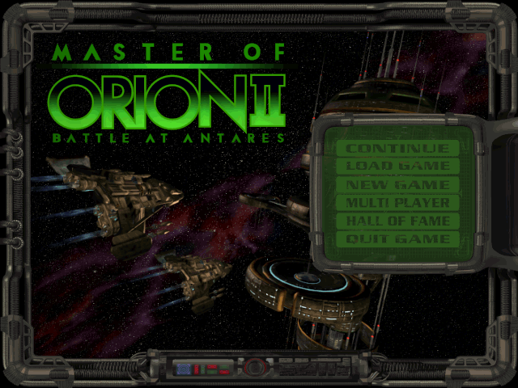
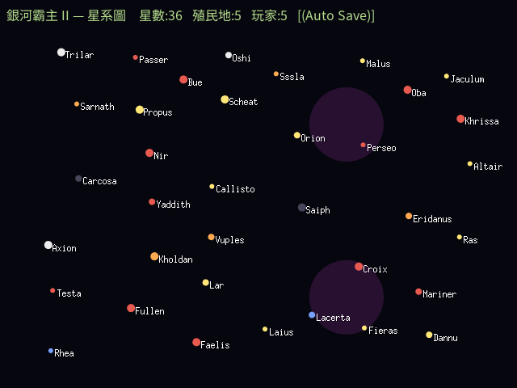

# 銀河霸主 2:安塔瑞斯之戰 — go/ebiten 重製 + 繁體中文化

以 [OpenOrion2](https://github.com/next-ghost/openorion2) 為參考基底,用 Go + [Ebitengine](https://ebitengine.org/) 重新打造《Master of Orion II: Battle at Antares》(1996),提供完整**繁體中文**在地化與英文原文切換,並支援 **1.3 / 1.5** 兩個版本的規則與資料。



> 上圖是**本專案的 go/ebiten renderer 實際輸出** —— 於 headless Docker 環境讀取玩家正版 `MAINMENU.LBX`,經自製的 LBX 解碼 → 調色盤 → RLE → ebiten 繪製全鏈路產生,像素與顏色皆對齊原版。

---

## 目前進度

專案分階段推進(詳見 [`PLAN.md`](PLAN.md) / [`WORKLIST.md`](WORKLIST.md))。已完成:

### ✅ Phase 0 — 可行性研究與知識庫
盤點 openorion2 完成度、中文化策略、字型、按鈕、LBX/patch、AI 策略,並吸收前作(魔法大帝 ebiten 繁中化)的實戰 playbook。見 [`docs/kickoff/`](docs/kickoff/)。

一個關鍵結論:openorion2 自述「partial savegame viewer, no gameplay」屬實 —— 它送給我們的是**資產解碼器 + 完整存檔資料模型**,而整個回合制引擎需依原版手冊從零重建。

### ✅ Phase 1 — 資料層移植(純 Go,全數以真實遊戲檔驗證)

| 模組 | 內容 | 驗證 |
|---|---|---|
| `internal/lbx` | LBX 容器 + 影像(scan-line RLE)+ 調色盤(6-bit→8-bit)解碼 | BEAMS 153/153、GAME 32/32 資產無誤解碼 |
| `internal/save` | 完整存檔 schema(Config/Galaxy/Colony/Planet/Star/Leader/Player/Ship) | `SAVE10.GAM` 解出真實種族(Trilarian/Alkari/…)、首星 Orion、計數自洽 |
| `internal/gamedata` | 28 個資料枚舉(技術 212/建築 49/…,自動生成)+ 唯讀衍生公式 | 項數吻合原始常數 + 已知值單元測試 |
| `internal/assets` | 檔案覆蓋載入(基礎 → 1.31 patch,搜尋路徑) | 覆蓋序 / 大小寫測試 |

### ✅ Phase 2 — ebiten backend(最小可跑,已 headless 驗證)
ebiten 於 Docker + xvfb headless 跑通,完整鏈路:

```
assets.Resolver → OpenLBX → DecodeImage → 內嵌調色盤 → RLE 解碼
  → ToRGBA → ebiten.NewImageFromImage → DrawImage → 截圖(ReadPixels)
```

上方主選單截圖即此管線的實際輸出。過程中確認 MOO2 畫面為 **640×480**。

**資料驅動星圖(M2 里程碑)+ 繁體中文渲染**:載入原版存檔 `SAVE10.GAM`,解析出星系並即時繪製 —— 每顆星依真實座標定位、依光譜類上色、依大小定尺寸,標出真實星名,星雲數與存檔一致;標題以自建的 CJK 文字系統(NotoSansCJK + ebiten text/v2)渲染成繁體中文。



> 圖中 36 顆星的名稱、位置、顏色與兩團星雲全來自解析 `SAVE10.GAM`;上方「銀河霸主 II — 星系圖」標題是本專案 CJK 文字管線的實際輸出,驗證了繁中渲染鏈。

### 中文化成果對照

原版各畫面的英文原貌已收錄為對照基準(見 [`docs/reference-screens.md`](docs/reference-screens.md)),供中文化 before/after 展示;各畫面的英文 UI 也是翻譯清單來源。

### ⏭ 進行中 / 下一步
`Screen` 介面抽象、滑鼠/鍵盤事件、資產快取;文字系統(CJK supersample)與主選單版本/語言切換;星圖換上真實 sprite 美術。

---

## 專案結構

```
internal/lbx/       LBX 容器 + 影像/RLE/palette 解碼
internal/save/      原版存檔完整解析(資料模型)
internal/gamedata/  枚舉字典(自動生成)+ 唯讀衍生公式
internal/assets/    資料檔搜尋路徑(base → patch 覆蓋)
cmd/moo2/           ebiten 遊戲主程式(骨架)
cmd/lbxdump/        .lbx 影像 → PNG 檢視工具
docs/kickoff/       可行性 + 策略 + AI + ebiten 繁中化 playbook
docs/tech/          逆向數值工程文件(LBX/存檔/枚舉/公式/ebiten)
docs/history/       遊戲歷史與評價考究
scripts/            docker build / test / 截圖 腳本
```

## 建置與執行

編譯與測試一律在 Docker 進行(不污染系統環境)。

```bash
# 純 Go 資料層測試
./scripts/test.sh

# headless 渲染截圖(需玩家自備的遊戲資料夾)
./scripts/screenshot.sh /path/to/mastori2 out.png -- -lbx mainmenu.lbx -asset 21

# 把某個 .lbx 內的影像全部輸出成 PNG 檢視
go run ./cmd/lbxdump path/to/FILE.LBX outdir/
```

## 遊戲資料(玩家自備正版)

本 repo **不含**任何原版遊戲檔、手冊或官方 patch(版權所有),也不含上游 openorion2 原始碼。
你需要自備正版《Master of Orion II》(如 GOG),把遊戲的 `*.lbx` 資料夾指給程式讀取。
README 的展示截圖僅為呈現 renderer 成果之用。

## 文件

- [`PLAN.md`](PLAN.md) — 分階段計畫與里程碑
- [`WORKLIST.md`](WORKLIST.md) — 可勾選工作清單
- [`docs/kickoff/`](docs/kickoff/) — 可行性研究與策略知識庫
- [`docs/tech/`](docs/tech/) — 逆向格式與數值工程文件
- [`docs/history/`](docs/history/) — 遊戲歷史、當年評價、華人圈接受考據
- [`docs/culture/`](docs/culture/) — 華人圈文化現象散文
- [`docs/reference-screens.md`](docs/reference-screens.md) — 原版畫面對照組(中文化 before/after 基準 + 翻譯清單)

## 致謝

- **[OpenOrion2](https://github.com/next-ghost/openorion2)**(next_ghost,GPL v2)—— LBX 資產解碼器與完整 MOO2 存檔資料模型逆向,本專案的參考基底。
- **[1oom](https://gitlab.com/1oom-fork/1oom) 社群** —— 前作《銀河霸主 1》繁中化的引擎與 CJK 經驗來源;其 AI(`game_ai_classic.c`)是本專案對手 AI 的架構參考。
- **魔法大帝繁中化 + [kazzmir/master-of-magic](https://github.com/kazzmir/master-of-magic) 引擎** —— 提供經三平台實戰驗證的 Go/Ebiten 老遊戲繁中化 playbook(顯示層覆蓋、supersample CJK、字型子集、截圖驗證紀律)。
- **MOO2 1.5 社群 patch 團隊** —— 持續維護的非官方 patch(至 2026 仍在更新),1.5 版規則與資料的權威來源。
- **開源中文字型作者** —— Noto Sans CJK TC(SIL OFL)為已驗證主字型;像素風字型列為美術選項待驗。
- 原作 **Simtex / MicroProse** —— 創造了這款不朽的經典。

## 授權

原始碼衍生自 GPL v2 的 OpenOrion2,故以 **GPL v2** 釋出。原版遊戲資產與字型各依其授權,不包含於本 repo。
