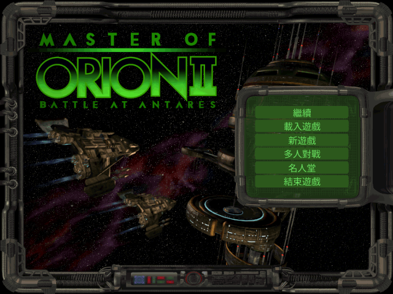

# 銀河霸主 2:安塔瑞斯之戰 — go/ebiten 重製 + 繁體中文化

以 [OpenOrion2](https://github.com/next-ghost/openorion2) 為參考基底,用 Go + [Ebitengine](https://ebitengine.org/) 重新打造《Master of Orion II: Battle at Antares》(1996),提供完整**繁體中文**在地化與英文原文切換,並支援 **1.3 / 1.5** 兩個版本的規則與資料。


> 上圖是**本專案的 go/ebiten renderer 實際輸出** —— 於 headless Docker 讀取玩家正版 `MAINMENU.LBX`,經自製的 LBX 解碼 → 調色盤 → RLE → ebiten 繪製全鏈路產生;六個按鈕的英文以「擦底疊字」抹除後疊上繁體中文(繼續 / 載入遊戲 / 新遊戲 / 多人對戰 / 名人堂 / 結束遊戲)。

**中文化前後對照**(原版英文 → 本專案繁中):

| 原版 | 繁中化 |
|---|---|
|  |  |

---

## 這個專案做到了什麼

1996 年的 4X 太空策略經典，用 Go 重寫、做到考據等級的繁體中文化。**不是套翻譯外掛，是從資料層到遊戲邏輯逐塊重建。**

- **完整繁體中文化**：逆向原版 **707 條百科全文**、**770 條外交對白**，總共 **3604 條訊息** 全數中文化，涵蓋 22 個字串來源、零漏源。
- **遊戲公式考據還原**：對照官方手冊與 openorion2，逐條移植殖民成長、光束命中與傷害、飛彈、間諜、地面戰、士氣、收入等公式，**每條都有手算對照的單元測試**（191 個測試全綠）。過程中還抓到手冊自己的筆誤（AMR 命中率、飛彈速度）並擋掉搜尋引擎生成的假數字。
- **自製回合引擎 + AI**：殖民經濟／研究／國庫的回合結算、單發戰鬥解算；AI 兩種模式並存架構 —— **remake**（設計性重建）與 **original**（連原版沒公開的 AI 難度加成表都從官方 patch 手冊挖出來移植）。
- **忠實與誠實並重**：原版素材（圖／音樂／音效）一律不打包，玩家自備正版；沒有權威來源的機制明確標「設計性重建，非原版」，絕不臆造冒充原版行為。

> **下載（alpha）**：[Releases](https://github.com/wicanr2/master-of-orion2-remake-cht/releases) 有 Linux（AppImage）與 Windows 版。目前是**畫面檢視器 + 引擎 + 完整中文化**可跑的階段，完整可玩（主迴圈／滑鼠鍵盤／音訊）仍在開發。需以 `-data` 指向你合法持有的 MOO2 遊戲資料。

---

## 目前進度

專案分階段推進(詳見 [`PLAN.md`](PLAN.md) / [`WORKLIST.md`](WORKLIST.md))。已完成:

### ✅ Phase 0 — 可行性研究與知識庫
盤點 openorion2 完成度、中文化策略、字型、按鈕、LBX/patch、AI 策略,並吸收前作(魔法大帝 ebiten 繁中化)的實戰 playbook。見 [`docs/kickoff/`](docs/kickoff/)。

一個關鍵結論:openorion2 自述「partial savegame viewer, no gameplay」屬實 —— 它送給我們的是**資產解碼器 + 完整存檔資料模型**,而整個回合制引擎需依原版手冊從零重建。

### ✅ Phase 1 — 資料層移植(純 Go,全數以真實遊戲檔驗證)

| 模組 | 內容 | 驗證 |
|---|---|---|
| `internal/lbx` | LBX 容器 + 影像(scan-line RLE)+ 調色盤(6-bit→8-bit)解碼 | BEAMS 153/153、GAME 32/32 資產無誤解碼 |
| `internal/save` | 完整存檔 schema(Config/Galaxy/Colony/Planet/Star/Leader/Player/Ship) | `SAVE10.GAM` 解出真實種族(Trilarian/Alkari/…)、首星 Orion、計數自洽 |
| `internal/gamedata` | 28 個資料枚舉(技術 212/建築 49/…,自動生成)+ 唯讀衍生公式 | 項數吻合原始常數 + 已知值單元測試 |
| `internal/assets` | 檔案覆蓋載入(基礎 → 1.31 patch,搜尋路徑) | 覆蓋序 / 大小寫測試 |

### ✅ Phase 2 — ebiten backend(最小可跑,已 headless 驗證)
ebiten 於 Docker + xvfb headless 跑通,完整鏈路:

```
assets.Resolver → OpenLBX → DecodeImage → 內嵌調色盤 → RLE 解碼
  → ToRGBA → ebiten.NewImageFromImage → DrawImage → 截圖(ReadPixels)
```

上方主選單截圖即此管線的實際輸出。過程中確認 MOO2 畫面為 **640×480**。

**資料驅動星圖(M2 里程碑)+ 繁體中文渲染**:載入原版存檔 `SAVE10.GAM`,解析出星系並即時繪製 —— 每顆星依真實座標定位、依光譜類上色、依大小定尺寸,標出真實星名,星雲數與存檔一致;標題以自建的 CJK 文字系統(NotoSansCJK + ebiten text/v2)渲染成繁體中文。


> 圖中 36 顆星的名稱、位置、顏色與兩團星雲全來自解析 `SAVE10.GAM`;上方「銀河霸主 II — 星系圖」標題是本專案 CJK 文字管線的實際輸出,驗證了繁中渲染鏈。

### 中文化成果對照

原版各畫面的英文原貌已收錄為對照基準(見 [`docs/reference-screens.md`](docs/reference-screens.md)),供中文化 before/after 展示;各畫面的英文 UI 也是翻譯清單來源。

### ✅ Phase 3+ — 中文化、遊戲邏輯、回合引擎、AI

- **完整中文化**:3604 條訊息、21 份 TSV 譯表(英文原文為 key 的顯示層覆蓋,不動資料層);6 個中文畫面檢視器(百科／科技總覽／種族統計／殖民地摘要／外交關係)。
- **遊戲邏輯層** `internal/gamedata`(14 模組):殖民成長、生產污染、研究樹(83 主題×8 領域)、軍官、艦艇衍生值、光束命中＋傷害、飛彈防禦、間諜、地面戰、士氣、收入、地形改造 —— 全對權威來源逐條驗證(見 [`docs/tech/moo2-formulas-reference.md`](docs/tech/moo2-formulas-reference.md))。
- **回合引擎** `internal/engine`:殖民經濟→研究→國庫的帝國回合、頂層 `RunGameTurn`、單發戰鬥解算、勝利條件、save↔engine adapter;headless 回合模擬器 `cmd/moo2sim`。
- **AI／外交(設計性重建 + 原版資料)** `internal/ai`、`internal/diplomacy`:AI 經濟／研究／生產／外交決策、17 級外交關係狀態機;`Decider` 介面支援 remake／original 兩模式(見 [`docs/tech/design-reconstruction.md`](docs/tech/design-reconstruction.md)、[`docs/tech/original-ai-re.md`](docs/tech/original-ai-re.md))。
- **打包**:Linux AppImage／Windows(純 Go)本機 docker 腳本 + macOS/Linux/Windows 的 GitHub Actions workflow(見 [`docs/tech/packaging.md`](docs/tech/packaging.md))。

### ⏭ 下一步
完整可玩的遊戲殼:滑鼠/鍵盤輸入、主迴圈、主選單版本/語言/AI 模式選擇、真實遊戲畫面疊字;音訊播放(音樂已確認為 `STREAM.LBX` 的 PCM,見 [`docs/tech/music-integration.md`](docs/tech/music-integration.md));基礎數值表(武器/裝甲,在 `Orion2.exe`,待逆向)。

---

## 專案結構

```
internal/lbx/       LBX 容器 + 影像/RLE/palette 解碼
internal/save/      原版存檔完整解析(資料模型)
internal/gamedata/  枚舉字典(自動生成)+ 唯讀衍生公式
internal/assets/    資料檔搜尋路徑(base → patch 覆蓋)
cmd/moo2/           ebiten 遊戲主程式(骨架)
cmd/lbxdump/        .lbx 影像 → PNG 檢視工具
docs/kickoff/       可行性 + 策略 + AI + ebiten 繁中化 playbook
docs/tech/          逆向數值工程文件(LBX/存檔/枚舉/公式/ebiten)
docs/history/       遊戲歷史與評價考究
scripts/            docker build / test / 截圖 腳本
```

## 建置與執行

編譯與測試一律在 Docker 進行(不污染系統環境)。

```bash
# 純 Go 資料層測試
./scripts/test.sh

# headless 渲染截圖(需玩家自備的遊戲資料夾)
./scripts/screenshot.sh /path/to/mastori2 out.png -- -lbx mainmenu.lbx -asset 21

# 把某個 .lbx 內的影像全部輸出成 PNG 檢視
go run ./cmd/lbxdump path/to/FILE.LBX outdir/
```

## 遊戲資料(玩家自備正版)

本 repo **不含**任何原版遊戲檔、手冊或官方 patch(版權所有),也不含上游 openorion2 原始碼。
你需要自備正版《Master of Orion II》(如 GOG),把遊戲的 `*.lbx` 資料夾指給程式讀取。
README 的展示截圖僅為呈現 renderer 成果之用。

## 文件

- [`PLAN.md`](PLAN.md) — 分階段計畫與里程碑
- [`WORKLIST.md`](WORKLIST.md) — 可勾選工作清單
- [`docs/kickoff/`](docs/kickoff/) — 可行性研究與策略知識庫
- [`docs/tech/`](docs/tech/) — 逆向格式與數值工程文件
- [`docs/history/`](docs/history/) — 遊戲歷史、當年評價、華人圈接受考據
- [`docs/culture/`](docs/culture/) — 華人圈文化現象散文
- [`docs/reference-screens.md`](docs/reference-screens.md) — 原版畫面對照組(中文化 before/after 基準 + 翻譯清單)

## 致謝

- **[OpenOrion2](https://github.com/next-ghost/openorion2)**(next_ghost,GPL v2)—— LBX 資產解碼器與完整 MOO2 存檔資料模型逆向,本專案的參考基底。
- **[1oom](https://gitlab.com/1oom-fork/1oom) 社群** —— 前作《銀河霸主 1》繁中化的引擎與 CJK 經驗來源;其 AI(`game_ai_classic.c`)是本專案對手 AI 的架構參考。
- **魔法大帝繁中化 + [kazzmir/master-of-magic](https://github.com/kazzmir/master-of-magic) 引擎** —— 提供經三平台實戰驗證的 Go/Ebiten 老遊戲繁中化 playbook(顯示層覆蓋、supersample CJK、字型子集、截圖驗證紀律)。
- **MOO2 1.5 社群 patch 團隊** —— 持續維護的非官方 patch(至 2026 仍在更新),1.5 版規則與資料的權威來源。
- **開源中文字型作者** —— Noto Sans CJK TC(SIL OFL)為已驗證主字型;像素風字型列為美術選項待驗。
- 原作 **Simtex / MicroProse** —— 創造了這款不朽的經典。

## 授權

原始碼衍生自 GPL v2 的 OpenOrion2,故以 **GPL v2** 釋出。原版遊戲資產與字型各依其授權,不包含於本 repo。
