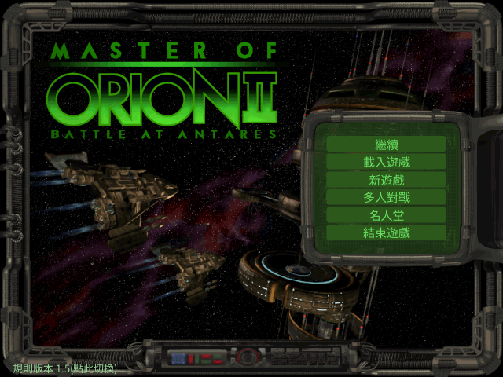
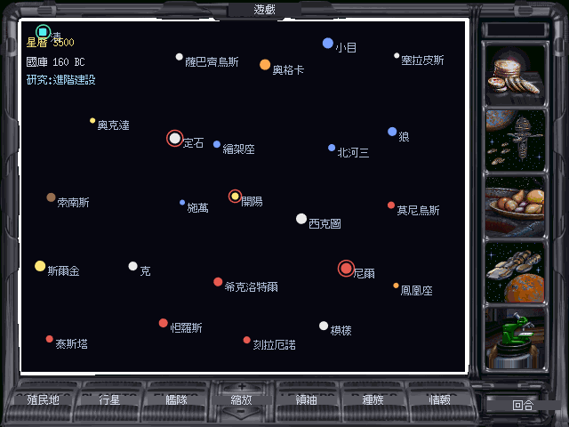
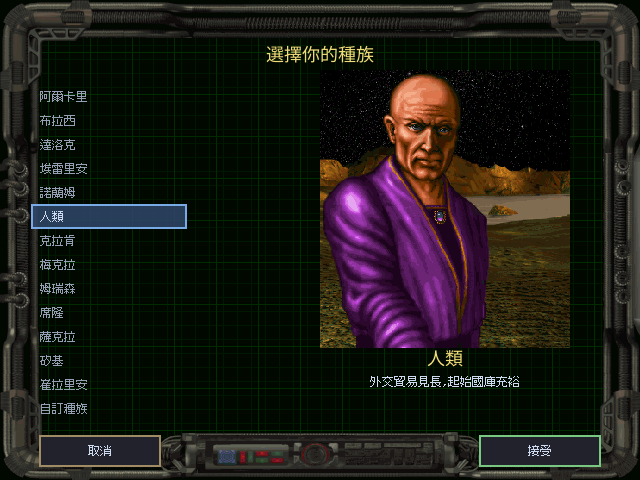
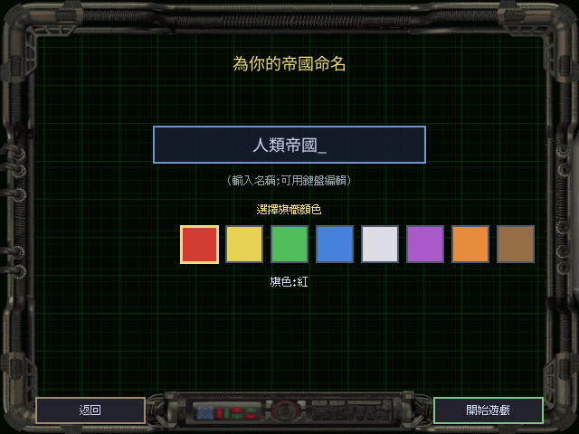
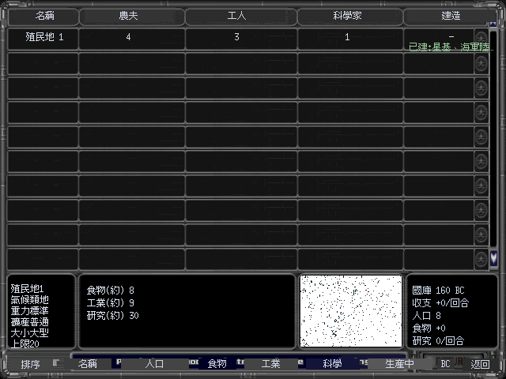
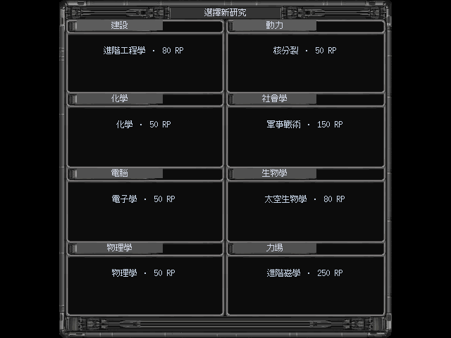
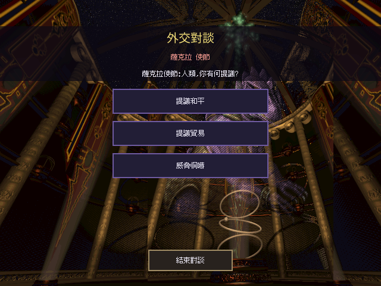
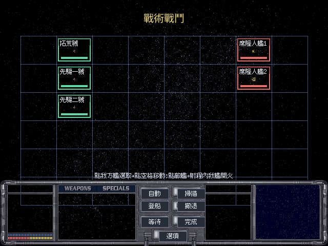

# 銀河霸主 2:安塔瑞斯之戰 — go/ebiten 重製 + 繁體中文化

以 [OpenOrion2](https://github.com/next-ghost/openorion2) 為參考基底,用 Go + [Ebitengine](https://ebitengine.org/) 重新打造《Master of Orion II: Battle at Antares》(1996),提供完整**繁體中文**在地化與英文原文切換,並支援 **1.3 / 1.5** 兩個版本的規則與資料。


> 上圖是**本專案的 go/ebiten renderer 實際輸出** —— 於 headless Docker 讀取玩家正版 `MAINMENU.LBX`,經自製的 LBX 解碼 → 調色盤 → RLE → ebiten 繪製全鏈路產生;六個按鈕的英文以「擦底疊字」抹除後疊上繁體中文(繼續 / 載入遊戲 / 新遊戲 / 多人對戰 / 名人堂 / 結束遊戲)。

**中文化前後對照**(原版英文 → 本專案繁中):

| 原版 | 繁中化 |
|---|---|
|  |  |

---

## 這個專案做到了什麼

用 Go + Ebitengine 重製《Master of Orion II》(1996) + 繁體中文化。**不是套翻譯外掛,是從資料層到遊戲邏輯逐塊重建。** 技術重點:

- **顯示層 i18n 覆蓋**(英文原文為 key,不動資料層):**3604 條字串**、22 個 LBX 字串來源全數 account、零漏源(逆向含 707 條百科全文、770 條外交對白)。
- **遊戲邏輯從零重建**:14 個 `gamedata` 公式模組,對官方手冊 + openorion2 **逐條驗證**,**191 個單元測試全綠**(戰鬥命中/傷害、飛彈、間諜、地面戰、殖民成長、士氣、收入…)。過程中抓到手冊自己的筆誤(AMR 命中率、飛彈速度)並擋掉搜尋引擎生成的假數字。
- **回合引擎**:`RunColonyTurn`→`RunEmpireTurn`→`RunGameTurn`(colony→research→treasury)+ 單發戰鬥解算 + save↔engine adapter,純函式、可單測。
- **AI 抽象成 `Decider` 介面**:**remake**(設計性重建)/ **original**(從官方 patch 手冊移植的難度加成表)兩實作,玩家可選,如同選 1.3/1.5 版本。
- **純 Go 跨平台**:ebiten v2.9 Windows backend 已 purego 化,`GOOS=windows CGO_ENABLED=0` 直接跨編;Linux AppImage / Windows / macOS(CI)打包齊備。
- **忠實與誠實並重**:原版素材(圖/音樂/音效)一律不打包,玩家自備正版;沒有權威來源的機制明確標「設計性重建,非原版」,絕不臆造冒充原版行為。

> **下載(alpha)**:[Releases](https://github.com/wicanr2/master-of-orion2-remake-cht/releases) 有 Linux(AppImage)與 Windows 版。目前是**可玩的多帝國 4X 迴圈**(殖民/研究/造艦/戰鬥/外交/三條勝利路徑,`cmd/moo2 -game`)+ 完整中文化 + 原版音樂音效的階段;逐畫面像素對齊、部分 UI 打磨與 vs 原版的忠實度仍在追趕(詳見 [`docs/HONEST-STATUS.md`](docs/HONEST-STATUS.md))。需以 `-data` 指向你合法持有的 MOO2 遊戲資料。

---

## 目前進度

專案分階段推進(詳見 [`PLAN.md`](PLAN.md) / [`WORKLIST.md`](WORKLIST.md))。已完成:

### ✅ Phase 0 — 可行性研究與知識庫
盤點 openorion2 完成度、中文化策略、字型、按鈕、LBX/patch、AI 策略,並吸收前作(魔法大帝 ebiten 繁中化)的實戰 playbook。見 [`docs/kickoff/`](docs/kickoff/)。

一個關鍵結論:openorion2 自述「partial savegame viewer, no gameplay」屬實 —— 它送給我們的是**資產解碼器 + 完整存檔資料模型**,而整個回合制引擎需依原版手冊從零重建。

### ✅ Phase 1 — 資料層移植(純 Go,全數以真實遊戲檔驗證)

| 模組 | 內容 | 驗證 |
|---|---|---|
| `internal/lbx` | LBX 容器 + 影像(scan-line RLE)+ 調色盤(6-bit→8-bit)解碼 | BEAMS 153/153、GAME 32/32 資產無誤解碼 |
| `internal/save` | 完整存檔 schema(Config/Galaxy/Colony/Planet/Star/Leader/Player/Ship) | `SAVE10.GAM` 解出真實種族(Trilarian/Alkari/…)、首星 Orion、計數自洽 |
| `internal/gamedata` | 28 個資料枚舉(技術 212/建築 49/…,自動生成)+ 唯讀衍生公式 | 項數吻合原始常數 + 已知值單元測試 |
| `internal/assets` | 檔案覆蓋載入(基礎 → 1.31 patch,搜尋路徑) | 覆蓋序 / 大小寫測試 |

### ✅ Phase 2 — ebiten backend(最小可跑,已 headless 驗證)
ebiten 於 Docker + xvfb headless 跑通,完整鏈路:

```
assets.Resolver → OpenLBX → DecodeImage → 內嵌調色盤 → RLE 解碼
  → ToRGBA → ebiten.NewImageFromImage → DrawImage → 截圖(ReadPixels)
```

上方主選單截圖即此管線的實際輸出。過程中確認 MOO2 畫面為 **640×480**。

**資料驅動星圖(M2 里程碑)+ 繁體中文渲染**:載入原版存檔 `SAVE10.GAM`,解析出星系並即時繪製 —— 每顆星依真實座標定位、依光譜類上色、依大小定尺寸,標出真實星名,星雲數與存檔一致;標題以自建的 CJK 文字系統(NotoSansCJK + ebiten text/v2)渲染成繁體中文。


> 圖中 36 顆星的名稱、位置、顏色與兩團星雲全來自解析 `SAVE10.GAM`;上方「銀河霸主 II — 星系圖」標題是本專案 CJK 文字管線的實際輸出,驗證了繁中渲染鏈。

### 中文化成果對照

原版各畫面的英文原貌已收錄為對照基準(見 [`docs/reference-screens.md`](docs/reference-screens.md)),供中文化 before/after 展示;各畫面的英文 UI 也是翻譯清單來源。

### ✅ Phase 3+ — 中文化、遊戲邏輯、回合引擎、AI

- **完整中文化**:3604 條訊息、21 份 TSV 譯表(英文原文為 key 的顯示層覆蓋,不動資料層);6 個中文畫面檢視器(百科／科技總覽／種族統計／殖民地摘要／外交關係)。
- **遊戲邏輯層** `internal/gamedata`(14 模組):殖民成長、生產污染、研究樹(83 主題×8 領域)、軍官、艦艇衍生值、光束命中＋傷害、飛彈防禦、間諜、地面戰、士氣、收入、地形改造 —— 全對權威來源逐條驗證(見 [`docs/tech/moo2-formulas-reference.md`](docs/tech/moo2-formulas-reference.md))。
- **回合引擎** `internal/engine`:殖民經濟→研究→國庫的帝國回合、頂層 `RunGameTurn`、單發戰鬥解算、勝利條件、save↔engine adapter;headless 回合模擬器 `cmd/moo2sim`。
- **AI／外交(設計性重建 + 原版資料)** `internal/ai`、`internal/diplomacy`:AI 經濟／研究／生產／外交決策、17 級外交關係狀態機;`Decider` 介面支援 remake／original 兩模式(見 [`docs/tech/design-reconstruction.md`](docs/tech/design-reconstruction.md)、[`docs/tech/original-ai-re.md`](docs/tech/original-ai-re.md))。
- **打包**:Linux AppImage／Windows(純 Go)本機 docker 腳本 + macOS/Linux/Windows 的 GitHub Actions workflow(見 [`docs/tech/packaging.md`](docs/tech/packaging.md))。

### ✅ Phase 5+ — 可玩的多帝國 4X 迴圈(2026-07-11,模擬探針 + GUI 導覽驗證)
`cmd/moo2 -game` 互動版已可從主選單一路玩到結束一局:玩家與 3 個性格互異的 AI 對手各自拓殖擴張,
經濟(殖民地建築/重力/礦產/士氣/指揮評等/收入)已對手冊逐項核實,戰鬥(光束/飛彈/球狀傷害/地面戰
陸戰隊+戰車+軌道轟炸)依真公式解算,三條勝利路徑(征服/銀河議會/安塔蘭母星反攻)全數接線可達成。
以上皆有 headless 模擬探針(數十~數百回合)與 GUI 導覽截圖(`-gamegallery`,8 畫面端到端)驗證,
70 回合無 panic。**這是「什麼現在能運作」的可驗證事實,不是還原度自評**——詳見
[`docs/HONEST-STATUS.md`](docs/HONEST-STATUS.md)。

### ⏭ 下一步
逐畫面像素級熱區對齊(多數仍是估計座標)、新遊戲流程與原版母星初始狀態的細節對齊、戰機/航母、
完整 spy/leader/diplomacy UI、武器 mod 的飛彈專屬項與小型化門檻、音樂曲目↔場景的最終聽感比對定案。
下一節「目前貢獻」逐項列出已驗證與仍缺的部分。

---

## 目前貢獻(已驗證可運作 / 仍缺)

> 現況基準:[`docs/HONEST-STATUS.md`](docs/HONEST-STATUS.md)(持續更新)。下列每項標示驗證方式
> (headless 模擬探針 / GUI 導覽截圖 / 單元測試),**不是自評還原度百分比**——與原版的實際還原度
> 仍待使用者實測,不是本專案自己下結論。

**資產與資料層**
- LBX 資產解碼:容器 / scan-line RLE 影像 / 調色盤鏈,對照 openorion2 逐位元組驗證(`internal/lbx`,見 [`docs/tech/lbx-format.md`](docs/tech/lbx-format.md))
- 存檔格式唯讀解析:`SAVE10.GAM` 全區段解出(殖民地/行星/星/領袖/玩家/艦艇)(`internal/save`,見 [`docs/tech/savegame-format.md`](docs/tech/savegame-format.md))

**中文化**
- 3604 條字串、22 個 LBX 字串來源全數 account,零漏源(見 [`docs/tech/string-sources.md`](docs/tech/string-sources.md))
- 四個專有名詞池全數定案:科技/元件 419 條、母星名、672 艦名、829 隨機星名(見 [`docs/tech/proper-noun-strategy.md`](docs/tech/proper-noun-strategy.md))
- 點陣繁中字型(`bitmapfont/v4` 混合:內文點陣、標題 Noto 向量),2258 字缺字 0(見 [`docs/tech/pixel-font-decision.md`](docs/tech/pixel-font-decision.md))

**可玩的 4X 迴圈**
- 殖民/拓殖:玩家與 3 個 AI 對手皆可建立新殖民地、經濟隨擴張成長(見 [`docs/tech/colonization.md`](docs/tech/colonization.md))
- 研究:83 主題 × 8 領域,每主題真實科技間抉擇(非線性自動推進)(見 [`docs/tech/research-system-status.md`](docs/tech/research-system-status.md))
- 戰鬥:光束/飛彈/球狀傷害依武器類型分流解算 + 地面戰(陸戰隊/戰車/軌道轟炸)(見 [`docs/tech/tactical-combat-weapon-kinds.md`](docs/tech/tactical-combat-weapon-kinds.md)、[`docs/tech/ground-combat-algorithm.md`](docs/tech/ground-combat-algorithm.md))
- 三條勝利路徑全接線可達成:征服 / 銀河議會選舉(手冊 2/3 多數)/ 安塔蘭母星反攻(見 [`docs/tech/victory-conditions.md`](docs/tech/victory-conditions.md))
- 間諜(偷科技最小迴圈)、領袖技能(25+ 技能中已接 2 項真實效果)(見 [`docs/tech/spy-system.md`](docs/tech/spy-system.md)、[`docs/tech/leader-officer-skills.md`](docs/tech/leader-officer-skills.md))

**音訊**
- 原版 PCM WAV 音樂/音效已接線(主選單 BGM + 按鈕音效),曲目對應定案到靜態溯源極限(見 [`docs/tech/audio-format.md`](docs/tech/audio-format.md)、[`docs/tech/audio-track-map.md`](docs/tech/audio-track-map.md))

**版本 / 打包**
- 1.3 / 1.5 規則差異已研究定案,`RuleProfile` 資料結構已接(見 [`docs/tech/version-1.3-1.5-diff.md`](docs/tech/version-1.3-1.5-diff.md))
- Linux AppImage / Windows(純 Go 跨編)/ macOS(CI)三平台打包(見 [`docs/tech/packaging.md`](docs/tech/packaging.md))

**仍在進行 / 仍缺**(不是「能不能玩」的阻塞,是「像不像原版」的差距)
- 逐畫面像素級熱區對齊(多數仍是估計座標,非整畫面返回鍵)
- 完整新遊戲流程與原版母星初始狀態的細節對齊
- 戰機/航母、完整 spy/leader/diplomacy UI、多 AI 對手的目標選擇策略(目前為索引順序,非距離/資源導向)
- 武器改造(mod)系統的飛彈專屬 mod、小型化等級門檻、火線角
- 音樂曲目↔場景的最終聽感比對(現用時長啟發式/反組譯佐證,非逐曲聆聽定案)
- 多人對戰(考據已定案為 lockstep over TCP,尚未實作,見 [`docs/tech/multiplayer-architecture.md`](docs/tech/multiplayer-architecture.md))

---

## 畫面預覽

以下皆為 `-gamegallery` headless 導覽拍下的**本專案 ebiten renderer 實際輸出**(讀取玩家正版 LBX 資產渲染,非原版截圖翻拍),對應上方「目前貢獻」逐項提到的系統:

| 主選單(含 1.3/1.5 規則版本切換) | 星系主畫面 |
|---|---|
|  |  |

| 種族選擇(原版獨立畫面 + 肖像) | 命名/旗色 |
|---|---|
|  |  |

| 殖民地總覽 | 研究選擇 |
|---|---|
|  |  |

| 外交使節 | 戰術戰鬥 |
|---|---|
|  |  |

---

## 專案結構

```
internal/lbx/       LBX 容器 + 影像/RLE/palette 解碼
internal/save/      原版存檔完整解析(資料模型)
internal/gamedata/  枚舉字典(自動生成)+ 唯讀衍生公式
internal/assets/    資料檔搜尋路徑(base → patch 覆蓋)
cmd/moo2/           ebiten 遊戲主程式(骨架)
cmd/lbxdump/        .lbx 影像 → PNG 檢視工具
docs/kickoff/       可行性 + 策略 + AI + ebiten 繁中化 playbook
docs/tech/          逆向數值工程文件(LBX/存檔/枚舉/公式/ebiten)
docs/history/       遊戲歷史與評價考究
scripts/            docker build / test / 截圖 腳本
```

## 建置與執行

編譯與測試一律在 Docker 進行(不污染系統環境)。

```bash
# 純 Go 資料層測試
./scripts/test.sh

# headless 渲染截圖(需玩家自備的遊戲資料夾)
./scripts/screenshot.sh /path/to/mastori2 out.png -- -lbx mainmenu.lbx -asset 21

# 把某個 .lbx 內的影像全部輸出成 PNG 檢視
go run ./cmd/lbxdump path/to/FILE.LBX outdir/
```

## 遊戲資料(玩家自備正版)

本 repo **不含**任何原版遊戲檔、手冊或官方 patch(版權所有),也不含上游 openorion2 原始碼。
你需要自備正版《Master of Orion II》(如 GOG),把遊戲的 `*.lbx` 資料夾指給程式讀取。
README 的展示截圖僅為呈現 renderer 成果之用。

## 文件索引

> 每份 `docs/*.md` 都在下面被至少一個分類收錄。文件是持續更新的工作紀錄,部分段落標了「2026-07-11 更新/訂正」——那是誠實記錄推翻先前錯誤斷言的過程(rulebook 63),不是文件品質問題。

### 計畫與現況(先讀這些)

- [`PLAN.md`](PLAN.md) — 分階段計畫與里程碑
- [`WORKLIST.md`](WORKLIST.md) — 可勾選工作清單(逐輪更新,允許擴充)
- [`docs/HANDOFF.md`](docs/HANDOFF.md) — 交接文件,重啟 session 或換人接手第一個要讀的檔
- [`docs/HONEST-STATUS.md`](docs/HONEST-STATUS.md) — 誠實現況評估(使用者實測還原度,校正過度樂觀的進度敘述)
- [`docs/reference-screens.md`](docs/reference-screens.md) — 原版畫面對照組(中文化 before/after 基準 + 翻譯清單)

### Kick-off 可行性研究(`docs/kickoff/`)

- [`00-feasibility.md`](docs/kickoff/00-feasibility.md) — 可行性總論,openorion2 基底評估的核心結論
- [`01-openorion2-assessment.md`](docs/kickoff/01-openorion2-assessment.md) — openorion2 完成度盤點(ground truth):哪些層可複用、哪些須從頭建
- [`02-cjk-strategy.md`](docs/kickoff/02-cjk-strategy.md) — 中文化策略,吸收 1oom(MOO1)繁中化實戰經驗
- [`03-button-cht.md`](docs/kickoff/03-button-cht.md) — 按鈕中文化策略,參考前作經驗避免重蹈覆轍
- [`04-font-choice.md`](docs/kickoff/04-font-choice.md) — 字型選擇判準與候選(最終決策見 `docs/tech/pixel-font-decision.md`)
- [`05-lbx-patch.md`](docs/kickoff/05-lbx-patch.md) — LBX 資產與 patch 1.3/1.5 的資料來源與版本策略
- [`06-ebiten-porting.md`](docs/kickoff/06-ebiten-porting.md) — openorion2(C++/SDL2)架構映射到 go/ebiten 的策略
- [`07-ai-strategy.md`](docs/kickoff/07-ai-strategy.md) — 對手 AI 策略:先參考文獻/一代移植,逆向是最後手段
- [`08-mom-ebiten-cht-playbook.md`](docs/kickoff/08-mom-ebiten-cht-playbook.md) — 魔法大帝(mom)ebiten 繁中化 playbook 萃取,可直接搬用的做法

### 遊戲歷史考據(`docs/history/`)

- [`moo2-history-and-reception.md`](docs/history/moo2-history-and-reception.md) — 開發背景、當年媒體評價、商業表現、patch 與社群維護史、類型史地位(14 來源)
- [`moo2-chinese-community.md`](docs/history/moo2-chinese-community.md) — 華人圈接受與討論考據,事實導向、逐點標來源(31 來源)

### 文化現象(`docs/culture/`)

- [`moo2-chinese-cultural-phenomenon.md`](docs/culture/moo2-chinese-cultural-phenomenon.md) — 華人老玩家集體記憶的敘事散文,事實建立在歷史考據文件之上

### 技術知識庫(`docs/tech/`)

[`docs/tech/README.md`](docs/tech/README.md) 是原本的知識庫總覽索引;下面依主題重新分組,涵蓋該目錄全部文件。

**資料格式(逆向紀錄)**
- [`lbx-format.md`](docs/tech/lbx-format.md) — `.lbx` 容器格式:magic、frame offset 表、內嵌調色盤、scan-line RLE
- [`savegame-format.md`](docs/tech/savegame-format.md) — `save?.gam` 存檔精確佈局,對照 `SAVE10.GAM` 逐欄位驗證
- [`enums.md`](docs/tech/enums.md) — 28 個資料枚舉對照(技術/研究主題/建築/種族特性…),自 `gamestate.h` 自動生成
- [`formulas.md`](docs/tech/formulas.md) — 唯讀衍生公式與查表精簡版(艦艇戰力/HP/戰速、行星產出、雇用費)
- [`moo2-formulas-reference.md`](docs/tech/moo2-formulas-reference.md) — 遊戲公式參考完整版,14 個系統逐條附出處與驗證範例
- [`palette-chain.md`](docs/tech/palette-chain.md) — 無內嵌調色盤畫面的上色機制破解(逐位元組對照 openorion2)
- [`patch15-cfg-data-source.md`](docs/tech/patch15-cfg-data-source.md) — patch 1.5 `.CFG` 檔案的潛在資料來源評估(需版本消歧)

**中文化 / 在地化**
- [`string-sources.md`](docs/tech/string-sources.md) — 22 個字串源總清單與翻譯進度(全數 account)
- [`i18n-catalog-architecture.md`](docs/tech/i18n-catalog-architecture.md) — 顯示層覆蓋 i18n 架構(英文 key)與同形詞稽核
- [`proper-noun-strategy.md`](docs/tech/proper-noun-strategy.md) — 四個專有名詞池(母星名/艦名/隨機星名/種族名)在地化策略
- [`pixel-font-decision.md`](docs/tech/pixel-font-decision.md) — 點陣中文字型決策:`bitmapfont/v4` 混合字型定案與驗證證據
- [`ui-typography-button-review.md`](docs/tech/ui-typography-button-review.md) — 中文 UI 字級/按鈕美術設計 review(依實測回饋)
- [`cjk-screen-rendering.md`](docs/tech/cjk-screen-rendering.md) — 自繪中文畫面的渲染樣板鏈路

**遊戲邏輯系統(gameplay 忠實化)**
- [`rules-implementation-audit.md`](docs/tech/rules-implementation-audit.md) — openorion2 遊戲規則實作程度盤點(結論:渲染殼,無回合引擎)
- [`game-logic-port.md`](docs/tech/game-logic-port.md) — 遊戲邏輯層移植進度總覽
- [`gameplay-systems-status.md`](docs/tech/gameplay-systems-status.md) — 逐系統標「已用真公式 / 自編近似待接」的忠實化盤點
- [`design-reconstruction.md`](docs/tech/design-reconstruction.md) — 設計性重建層的誠實界定(官方未給精確規則時怎麼標)
- [`community-mechanics-findings.md`](docs/tech/community-mechanics-findings.md) — 官方手冊未給數字時的社群 mechanics 補充研究筆記
- [`homeworld-init.md`](docs/tech/homeworld-init.md) — 開局母星初始狀態萃取(人口/建築/艦隊/科技/資源)
- [`newgame-flow.md`](docs/tech/newgame-flow.md) — 原版新遊戲流程 + 種族選擇畫面盤點
- [`custom-race-picks.md`](docs/tech/custom-race-picks.md) — 自訂種族 Picks 點數表來源與方法
- [`colonization.md`](docs/tech/colonization.md) — 最小拓殖接線紀錄(玩家/AI 建立新殖民地)
- [`colony-buildings.md`](docs/tech/colony-buildings.md) — 殖民地建築全表(手冊萃取,建造/維護/效果)
- [`colony-economy-maintenance.md`](docs/tech/colony-economy-maintenance.md) — 維護費與行星驅動 yield 接線調查
- [`research-system-status.md`](docs/tech/research-system-status.md) — 研究/科技系統現況與「抉擇機制」還原計畫
- [`ground-combat-algorithm.md`](docs/tech/ground-combat-algorithm.md) — 地面戰解算演算法(社群逆向 + 已知歧義)
- [`tactical-combat-assets.md`](docs/tech/tactical-combat-assets.md) — 格子戰術戰鬥畫面原版資產清單與重建規格
- [`tactical-combat-weapon-kinds.md`](docs/tech/tactical-combat-weapon-kinds.md) — 戰鬥解算依武器類型(beam/missile/spherical)分流
- [`cmbtshp-ship-sprites.md`](docs/tech/cmbtshp-ship-sprites.md) — 戰鬥艦 sprite 結構與艦級對照
- [`diplomat-lbx-layout.md`](docs/tech/diplomat-lbx-layout.md) — `DIPLOMAT.LBX` 佈局破解與外交畫面重建
- [`ship-design-space.md`](docs/tech/ship-design-space.md) — 艦艇設計空間格模型(艦體/武器佔格)
- [`weapon-mods.md`](docs/tech/weapon-mods.md) — 武器改造(mod)系統,8 個光束/通用 mod 逐字核對手冊數字
- [`component-values.md`](docs/tech/component-values.md) — 艦艇元件數值來源狀態(provenance,避免把印象值當權威)
- [`component-tech-mapping.md`](docs/tech/component-tech-mapping.md) — 艦艇元件 → 真 MOO2 科技對應表
- [`victory-conditions.md`](docs/tech/victory-conditions.md) — 三條勝利路徑(征服/議會/安塔蘭)手冊權威規則與接線現況
- [`spy-system.md`](docs/tech/spy-system.md) — 間諜系統最小可玩迴圈(訓練→結算→偷科技)
- [`leader-officer-skills.md`](docs/tech/leader-officer-skills.md) — 領袖/軍官技能系統接線(25+ 技能中已接 2 項)
- [`screen-spec-info-research.md`](docs/tech/screen-spec-info-research.md) — 資訊/研究畫面渲染規格分析

**渲染 / UI 規劃**
- [`ebiten-notes.md`](docs/tech/ebiten-notes.md) — Phase 2 ebiten 移植工程筆記(640×480、docker headless、截圖)
- [`ui-adjustment.md`](docs/tech/ui-adjustment.md) — UI 界面調整可行性(版面/座標/縮放層級)
- [`screen-rebuild-plan.md`](docs/tech/screen-rebuild-plan.md) — 自繪畫面 → 原版佈局重建計畫,標出哪些畫面仍非原版 UI
- [`sprite-tile-quality.md`](docs/tech/sprite-tile-quality.md) — sprite/tile 畫質優化與重繪可行性

**AI / 外交**
- [`ai-decision-modes.md`](docs/tech/ai-decision-modes.md) — AI 決策層與外交關係層架構
- [`ai-fiscal-solvency.md`](docs/tech/ai-fiscal-solvency.md) — AI 財政保底(職務分配防止財政發散)
- [`original-ai-re.md`](docs/tech/original-ai-re.md) — 原版 MOO2 AI 逆向考據筆記(`OriginalDecider` 研究基礎)

**音訊**
- [`music-integration.md`](docs/tech/music-integration.md) — 音樂/音效整合可行性總論
- [`audio-format.md`](docs/tech/audio-format.md) — 音訊格式第一性原理逆向(推翻 XMIDI 假設,實為 PCM WAV)
- [`audio-track-map.md`](docs/tech/audio-track-map.md) — 曲目/音效 entry 對應到場景與 UI 事件

**版本 / 打包 / 多人**
- [`version-1.3-1.5-diff.md`](docs/tech/version-1.3-1.5-diff.md) — patch 1.3 → 1.5 規則/數值差異與版本 profile 設計
- [`packaging.md`](docs/tech/packaging.md) — 跨平台打包(CI + 本機 docker 腳本兩條路徑)
- [`multiplayer-architecture.md`](docs/tech/multiplayer-architecture.md) — 多人對戰原版通訊考據 + 重製架構建議(lockstep over TCP)

**現況盤點 / 路線圖**
- [`remaining-work-roadmap.md`](docs/tech/remaining-work-roadmap.md) — 剩餘工作依阻塞類型分類的決策排序路線圖

## 致謝

- **[OpenOrion2](https://github.com/next-ghost/openorion2)**(next_ghost,GPL v2)—— LBX 資產解碼器與完整 MOO2 存檔資料模型逆向,本專案的參考基底。
- **[1oom](https://gitlab.com/1oom-fork/1oom) 社群** —— 前作《銀河霸主 1》繁中化的引擎與 CJK 經驗來源;其 AI(`game_ai_classic.c`)是本專案對手 AI 的架構參考。
- **魔法大帝繁中化 + [kazzmir/master-of-magic](https://github.com/kazzmir/master-of-magic) 引擎** —— 提供經三平台實戰驗證的 Go/Ebiten 老遊戲繁中化 playbook(顯示層覆蓋、supersample CJK、字型子集、截圖驗證紀律)。
- **MOO2 1.5 社群 patch 團隊** —— 持續維護的非官方 patch(至 2026 仍在更新),1.5 版規則與資料的權威來源。
- **開源中文字型作者** —— Noto Sans CJK TC(SIL OFL)為已驗證主字型;像素風字型列為美術選項待驗。
- 原作 **Simtex / MicroProse** —— 創造了這款不朽的經典。

## 授權

原始碼衍生自 GPL v2 的 OpenOrion2,故以 **GPL v2** 釋出。原版遊戲資產與字型各依其授權,不包含於本 repo。
