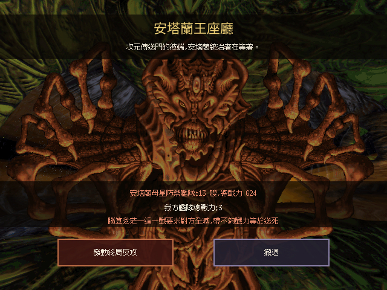

# 銀河霸主 II：安塔瑞斯之戰

## 一場重新回到銀河的繁體中文 4X 冒險

如果你曾經在《Master of Orion II: Battle at Antares》的星圖前，為了下一項科技、
下一顆殖民星，或下一場決定銀河命運的艦隊戰鬥熬過一個晚上，這個專案就是為了讓那份
節奏重新活起來。

本專案以 Go 與 Ebitengine 重製 1996 年經典《Master of Orion II》，從玩家自備的原版
資料讀取畫面、音樂與音效，重建一個可以實際遊玩的多帝國 4X 迴圈，並提供繁體中文
介面與英文模式切換。你可以建立自訂種族、拓殖星系、分配殖民地工作、研究科技、設計艦艇，
在格子戰術與快速結算之間作出選擇，再透過外交、間諜、領袖與戰爭走向三條勝利道路之一。

> **目前定位：可玩 remake 預覽，不是已完成的原版忠實重製。** 截至 2026-08-29 的最新盤點，
> 2026-08-25 啟動的 IDA Pro
> 重新稽核確認，部分議會、轟炸、外交、AI、經濟與戰鬥規則仍採 remake 自行設計或近似模型。
> 專案目前先補齊原版玩家可見機制的 RE 知識庫，再恢復規格與 Go／Ebitengine 實作；
> compiler helper、C runtime 與 Windows API 內部不納入完成分母。每項玩法逐步建立「原版函式、
> 資料流與證據等級 → 規格 → Go 規則 → UI／存檔／測試」的證據鏈。稽核結果見
> [原版忠實度重新稽核](docs/re/parity-re-audit-20260812.md)；逐系統進度見
> [原版忠實度矩陣](docs/re/parity-matrix.tsv)。

### Remake 自評儀表板（2026-08-29）

| 維度 | 自評 | 可重算口徑 |
|---|---:|---|
| remake 功能完成度 | **74%** | `WORKLIST.md` 唯一活表的 40 個實作／交付母項：26 項完成、7 項進行中、7 項待辦；完成計 1、進行中計 0.5，故 `(26 + 7×0.5) / 40`，四捨五入為 74%。另有 22 個已完成 RE-only 證據切片，不混入功能分母 |
| 原版玩法對齊度 | **51%** | `docs/re/parity-matrix.tsv` 41 個玩家系統逐列同看「remake 狀態」與「原版對齊狀態」：9 項已對齊、24 項部分對齊、8 項明確未對齊；部分對齊計 0.5，故 `(9 + 24×0.5) / 41`，四捨五入為 51% |
| 發行驗證完成度 | **33%** | 三個獨立閘門中，打包工程抽樣已通過；最新工作樹重打包／三平台真機與外部音訊逐曲人耳驗收尚未完成，故 `1 / 3` |

這三個百分比是當日工程快照，不是單一總分。尤其「原版玩法對齊度」不代表逐幀、逐像素、
逐位元或原版亂數序列一致；單元測試通過或 RE 證據閉合也不會自動增加功能完成度。這次
對齊分數變動來自 41 列矩陣的逐列重分級；它不表示所有新 RE 結論都已實作。發行分數仍以
最新提交完成打包、三平台真機與外部音訊驗收三個獨立閘門計算。

### 中文化不是選單翻譯

4X 的樂趣不只在按下「結束回合」，而在每一回合讀懂人口配置、殖民地產出、科技取捨、
艦艇元件、外交關係與戰場資訊，再把它們組合成自己的帝國策略。本專案不把英文按鈕換成
中文字就宣告完成；它在已接入的玩家主流程中，讓帝國經營、研究選擇、艦艇設計與武器改造、
外交、間諜、領袖與戰鬥資訊能以繁體中文被直接閱讀與操作。

我們不試圖把這款遊戲的複雜度磨平。中文化要做的是移除語言障礙，讓策略深度回到策略本身。
為此，專案重新建立資料解析、回合經濟、研究、造艦、戰鬥、外交、領袖管理、人工智慧（AI）、
存檔與多人對戰等可玩的骨架；同時保留原版 LBX 美術與 640×480 的邏輯畫布，讓繁中字型與
經典像素畫面在同一個介面裡共存。


> 這張圖是本專案的實際遊戲畫面。公開版不附原版遊戲資料；畫面、音樂與
> 音效會從玩家合法持有的資料目錄載入。

---

## 已完成的 remake 工程能力

- **可玩的多帝國 4X 主流程**：從新遊戲、種族與旗色設定開始，進入星系、殖民地、研究、
  生產、艦隊、戰鬥、外交與勝利判定；這表示玩家路徑已接通，不表示每項公式與原版一致。
- **為 4X 設計的繁體中文化與英文模式**：自繪 UI、原版烘字畫面、名稱池，以及已接入主流程的
  殖民地產出、科技、元件改造、條約、間諜、領袖與主要遊戲訊息都有對應語言路徑；原版美術上的
  英文在英文模式會保留原貌。
- **原版資料驅動的畫面**：自行解析 LBX 容器、調色盤、RLE 圖像與部分存檔資料，將原版
  美術接到 Go／Ebitengine 的跨平台渲染器（renderer）。
- **主要帝國經營工具**：殖民地經濟、科技選擇、艦艇設計、武器改造、領袖／軍官管理、
  RACES 間諜行動、條約、餽贈與特殊貿易都已接入重製版的玩家流程。
- **完整的殖民地生產操作**：七格建造佇列支援購買完成、自動建造、可重複的殖民船／前哨船／
  Special，以及同星系艦艇改裝；改裝工作會保存、可在多人鎖步重播，並清楚標示自動模板
  屬於 remake 近似。
- **兩種戰鬥體驗**：快速戰鬥結算與格子戰術戰鬥分開處理，包含光束、飛彈、戰機、地面戰、
  安塔瑞斯終局與戰鬥視覺特效；戰機基地的原版最佳武器／裝甲戰略強度公式與殖民地原版起始
  職務分支已接回，其他部分
  戰機、轟炸、防禦與地面戰資料流仍在原版忠實度稽核中。
- **多人對戰基礎**：保留熱座玩法；TCP 決定性鎖步（lockstep）的主機／客戶端、共同開局
  快照、回合指令同步與失同步停止對局都有對應流程。重連、心跳、挑戰式身份驗證與可選
  傳輸層安全（TLS）也已納入；跨網路位址轉換（NAT）仍需要外部中繼服務（relay）或
  通用隨插即用（UPnP）。
- **音樂與音效**：支援從玩家資料中的 `STREAM.LBX`、`STREAMHD.LBX` 與 `SOUND.LBX`
  讀取原版 PCM 音訊，並依主選單、星圖、外交、研究、戰鬥等場景切換。
- **跨平台發行**：提供 Linux AppImage、Windows amd64 ZIP 與 macOS universal tar.gz；
  macOS universal 包含 `arm64` 與 `x86_64` 版本。

### 中文化前後對照

| 原版英文 | 本專案繁體中文 |
|---|---|
|  |  |

### 當年評測看見的深度

1996 年 11 月，GameSpot 的 [Trent Ward 評測](https://www.gamespot.com/reviews/master-of-orion-ii-battle-at-antares-review/1900-2542439/)
給予本作 8.7／10：它肯定續作擴張後的經濟、社會與軍事控制，以及自訂種族、多行星殖民、
艦艇戰鬥與多人選項；同時也坦言，這種資訊與選項的密度可能讓新手感到挫折。1997 年 3 月的
[《PC Gamer》美國版第 34 期](https://www.retromags.com/magazines/usa/pc-gamer/pc-gamer-issue-34/)
亦收錄本作評測；其 86 分與對微管理的保留，可在
[當期評論彙整](https://www.metacritic.com/game/master-of-orion-ii-battle-at-antares/critic-reviews/)查閱。

這些當年的觀察正是本重製版重視繁體中文化的理由：不減少決策，而是讓殖民地經營、研究、
艦艇設計、外交與戰鬥的資訊能被中文玩家直接讀懂並使用。更多評分、褒貶與來源請見
[《銀河霸主 2》歷史與評價考究](docs/history/moo2-history-and-reception.md)。

---

## 下載與安裝

請前往 [GitHub Releases](https://github.com/wicanr2/master-of-orion2-remake-cht/releases)
下載對應平台的公開包：

| 平台 | 公開包 |
|---|---|
| Linux x86_64 | `MasterOfOrion2-cht-x86_64.AppImage` |
| Windows amd64 | `MasterOfOrion2-cht-windows-amd64.zip` |
| macOS | `MasterOfOrion2-cht-macos-universal.tar.gz`（`arm64`／`x86_64`） |

下載後可用 Release 附帶的 `PUBLIC-SHA256SUMS` 驗證檔案：

```bash
sha256sum -c PUBLIC-SHA256SUMS
```

macOS 公開包目前未做 Apple 正式簽署與公證；首次啟動可能需要依 macOS 的安全提示手動允許。

### 啟動遊戲

公開包不含原版遊戲資料。請先準備合法持有的《Master of Orion II》資料目錄，再把它傳給
`-data`；繁中模式另需指定可用的中日韓（CJK）字型：

```bash
./MasterOfOrion2-cht-x86_64.AppImage \
  -data /path/to/mastori2 \
  -font /path/to/your-cjk-font.ttc
```

Windows 請將指令替換為 `moo2.exe`，macOS 則從解開的 `.app` 啟動。進入主選單後即可選擇
1.3／1.5 規則版本、繁體中文／英文與遊戲模式；也可以用 `-lang en` 直接啟動英文模式。

### 公開版資產政策

Git 儲存庫與公開發行頁（Release）**不包含**原版 `.LBX`、`STREAM`／`STREAMHD`、`SOUND`、原版
手冊或未授權字型。這些資料仍由玩家自行取得並依原授權使用；本專案只發布自己的程式碼、
譯文、工具與不含版權遊戲素材的工程文件。工作樹中若存在帶入正版資料的「完整版」測試包，
僅供相應授權下的本機測試，不是公開下載內容。

格式與打包細節請見 [`docs/tech/packaging.md`](docs/tech/packaging.md) 與
[`RELEASE_NOTES-v0.1.0.md`](RELEASE_NOTES-v0.1.0.md)。

---

## 畫面預覽

遊戲使用 640×480 邏輯畫布；輸出可以整數倍放大，保留原版像素比例。以下代表畫面由目前
工作樹以 `-gamegallery` 產生；2026-08-27 已將下列九張 remake 圖片同步到同一輪繁中畫廊，並
抽查新局、種族、殖民地、外交、安塔蘭、多人、建造佇列與艦艇設計。動態文字均落在所屬按鈕
或美術面板內。這些圖片是 remake 版面驗收，不是原版逐像素對照：

| 新局設定 | 種族選擇 |
|---|---|
|  |  |

| 殖民地經營 | 外交選項 |
|---|---|
|  |  |

| 安塔蘭戰役 | 多人遊戲設定 |
|---|---|
|  |  |

| 殖民地生產控制 | 艦艇設計 |
|---|---|
|  |  |

更多畫面：

- [完整繁中畫廊](docs/screenshots/)
- [英文模式畫廊](docs/screenshots/en/)
- [原版／重製畫面對照](docs/reference-screens.md)

推廣影片使用者自備音樂，目前只保留在本機授權預覽，不列入公開 Release；打包與素材界線見
[`docs/tech/packaging.md`](docs/tech/packaging.md)。

---

## 從原始碼建置與抽樣驗證

本專案的編譯、測試、截圖與 GUI 驗證都在 Docker 中執行，以免污染主機環境。

```bash
# 編譯 Go 目標
./scripts/build.sh ./cmd/moo2

# 純 Go 套件抽樣測試
./scripts/test.sh

# 需要 Ebitengine／Xvfb 的 GUI 目標測試
./scripts/test-ebiten.sh ./cmd/moo2

# 從玩家資料產生一張無視窗（headless）截圖
./scripts/screenshot.sh /path/to/mastori2 out.png -- \
  -lbx mainmenu.lbx -asset 21
```

LBX 資產檢視與其他低階驗證入口，請見
[`docs/tech/README.md`](docs/tech/README.md)。

重新打包公開 Linux／Windows 產物：

```bash
./scripts/package-appimage.sh
./scripts/package-windows.sh
```

測試結果請以報告與矩陣為準，而不是只看編譯是否成功：

- [遊戲測試報告](docs/GAME-TEST-REPORT-2026-08-11.md)
- [抽樣玩家路徑紀錄](docs/PLAYTEST-2026-08-10.md)
- [驗證矩陣](docs/VERIFICATION-MATRIX.md)
- [公開 Release notes](RELEASE_NOTES-v0.1.0.md)

---

## 文件分層

README 只負責介紹遊戲、成果與開始方式；工程斷言、逆向證據、限制與驗證方法依下列階層
保存，避免把會變動的研究快照混進玩家入口：

```text
README.md                         玩家入口：遊戲介紹、成果、安裝與下載
├── docs/HONEST-STATUS.md         現況、已接功能、近似、未知與刻意差異
├── docs/tech/README.md            技術知識庫總索引
│   ├── multiplayer-architecture.md 多人協定與重製決策
│   ├── audio-track-map.md         音樂場景派發與音訊限制
│   └── packaging.md               三平台打包與公開資產政策
├── docs/re/parity-matrix.tsv      逐系統 remake／原版對齊狀態與下一證據閘門
├── docs/re/01-gap-report.md       逆向工程日誌與規則入口
├── docs/re/                       位址、資料流、視覺與原版驗證器（oracle）證據
├── docs/VERIFICATION-MATRIX.md    測試、畫廊、玩家路徑與原版驗證器（oracle）矩陣
├── docs/REMAKE-PLAN.md            架構、垂直切片與交付計畫
├── docs/RESEARCH-LOG.md           研究帳本與證據分級
└── WORKLIST.md                    唯一活表、停止線與可重現的下一步
```

建議閱讀順序：

1. 想玩遊戲：本 README → [下載與安裝](#下載與安裝)。
2. 想知道目前做到哪裡：[誠實現況](docs/HONEST-STATUS.md) → [遊戲測試報告](docs/GAME-TEST-REPORT-2026-08-11.md)。
3. 想追查工程依據：[技術文件索引](docs/tech/README.md) → [逆向證據](docs/re/)。
4. 想接手開發：[重製計畫](docs/REMAKE-PLAN.md) → [驗證矩陣](docs/VERIFICATION-MATRIX.md) → [唯一活表](WORKLIST.md)。

現況文件會隨程式碼、測試與證據更新；README 只列有日期、可由唯一活表與矩陣重算的三項
儀表板，不複製逐項待辦，也不作未經確認的原版等價宣稱。

---

## 專案結構

```text
internal/lbx/       LBX 容器、影像／RLE／調色盤解碼
internal/save/      原版存檔資料解析
internal/gamedata/  枚舉、查表與遊戲公式
internal/assets/    遊戲資料搜尋路徑與覆蓋
cmd/moo2/           Ebitengine 遊戲程式
cmd/moo2sim/        純 Go headless 回合模擬器
cmd/lbxdump/        LBX 資產檢視工具
assets/i18n/        專案自有的繁中／英文譯文
docs/               玩家、研究、技術、逆向與驗證文件
scripts/            Docker 建置、測試、截圖與打包腳本
```

## 致謝與授權

- [OpenOrion2](https://github.com/next-ghost/openorion2)：LBX 資產與存檔資料模型的研究參考。
- [1oom](https://gitlab.com/1oom-fork/1oom) 社群：前作繁中化與 AI 架構經驗。
- [kazzmir/master-of-magic](https://github.com/kazzmir/master-of-magic)：Go／Ebitengine 老遊戲
  繁中化與跨平台實作經驗。
- MOO2 1.5 社群 patch 與開源中文字型作者：規則研究與可授權的工具基礎。
- Simtex／MicroProse：創造這款經典作品的原作者團隊。

本專案原始碼依 GPL v2 發布。原版遊戲資料、音樂、音效、畫面與字型不包含於本儲存庫（repository），
各自依其授權與玩家持有的合法來源使用。
