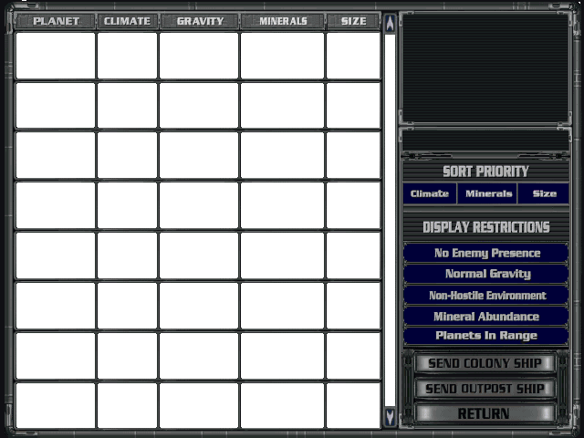
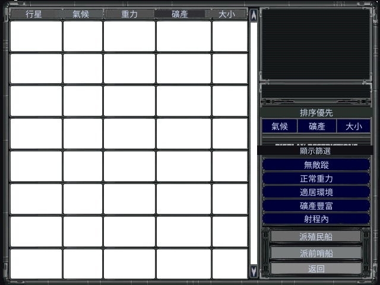
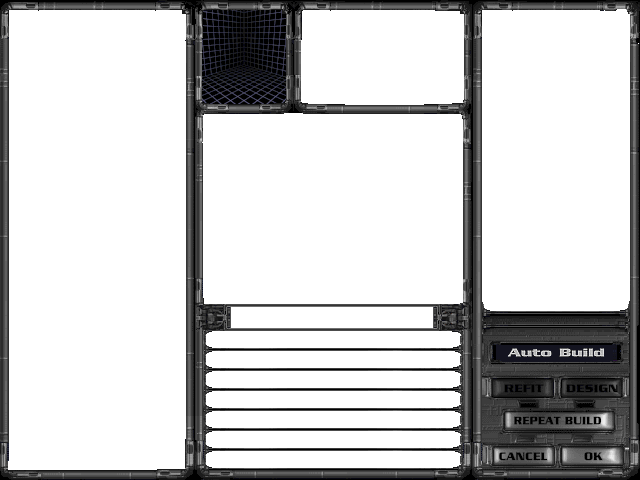

# 原版畫面對照組(中文化 before/after 基準)

蒐集原版《Master of Orion II》各畫面的英文原貌,作為中文化成果的對照基準:每個畫面日後配上我們的繁中版並排,即成 before → after。同時,各畫面可見的英文 UI 字串就是該畫面的**翻譯清單**。

畫面由本專案的 `cmd/lbxdump` 從玩家正版 `.lbx` 解碼渲染(非外部截圖);目前收錄「內嵌調色盤、可自包含正確上色」的畫面,其餘畫面需 Phase 4 的全域調色盤鏈,屆時補齊。

## 已收錄

### 主選單(MAINMENU.LBX 資產 21)✅ 已中文化

| 原版英文 | 繁中化(擦底疊字) |
|---|---|
|  |  |

英文 UI(對應 `assets/i18n/menu.tsv`,已翻):Continue、Load Game、New Game、Multi Player、Hall of Fame、Quit Game。
手法:六按鈕英文烘在背景圖(New Game 只有 hover sprite、idle 靠背景證實),故用擦底疊字 —— 採樣按鈕底色蓋掉英文 + 疊置中中文(座標取自 openorion2 mainmenu.cpp:415,y=172/195/217/240/262/285)。
重現:`moo2 -menu -data <遊戲夾> -font <CJK字型> -shot out.png`。

### 行星列表(PLNTSUM.LBX 資產 0)✅ 已中文化

| 原版英文 | 繁中化 |
|---|---|
|  |  |

18 個標籤覆蓋(`assets/i18n/planets.tsv`,座標多取自 openorion2 `PlanetsListView::initWidgets`):
欄位(行星/氣候/重力/礦產/大小)、排序優先 + 排序鈕、顯示篩選 + 5 個篩選(無敵蹤/正常重力/適居環境/礦產豐富/射程內)、派殖民船/派前哨船/返回。
重現:`moo2 -planets -data <遊戲夾> -font <字型> -shot out.png`。
> 已知小瑕疵:「顯示篩選」下方原本又寬又粗的 DISPLAY RESTRICTIONS 以單一採樣色擦不乾淨,邊緣微透 —— 待改用「從空白處採樣底色」精修。

### 殖民地建造(COLBLDG.LBX 資產 0)

英文 UI(待翻,建議 `assets/i18n/colony.tsv`):Auto Build、Refit、Design、Repeat Build、Cancel、OK。

## 待補(需全域調色盤鏈,Phase 4)

下列畫面的背景圖不含內嵌調色盤,需先取得該畫面的調色盤來源(openorion2 模式:背景圖或 GUI 圖提供 palette)才能正確上色:殖民地主畫面(COLONY)、艦艇設計(DESIGN)、殖民地系統顯示(COLSYSDI)、議會(COUNCIL)、外交(DIPLOMAT)、艦隊(FLEET)、科技選擇(TECHSEL)等。

## 用途

1. **中文化 before/after 展示**:同畫面英文原版 vs 繁中版並排。
2. **翻譯清單來源**:各畫面英文 UI 字串 → 對應 `assets/i18n/*.tsv`(英文原文即 key)。
3. **烘字位置參考**:按鈕/標籤在圖上的座標,供 Phase 4 疊中文時定位(對應 mom 的擦底疊字 / IMGLOG 探查)。
